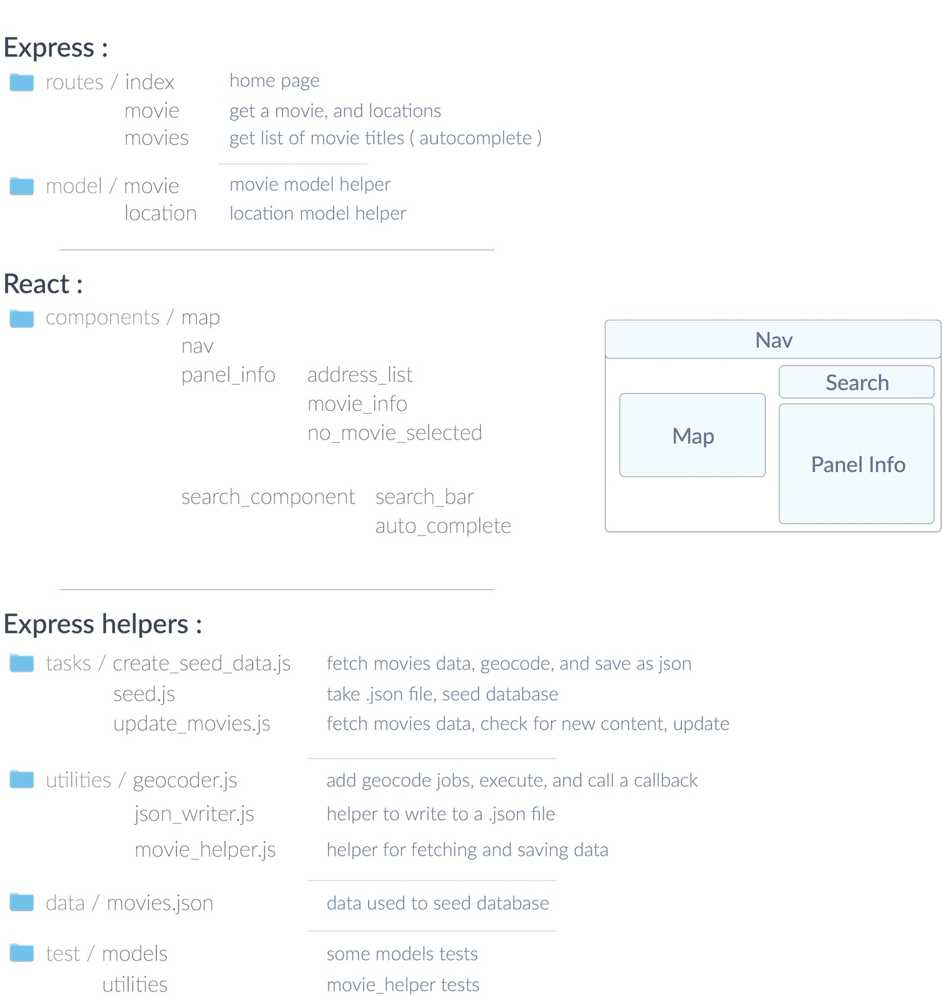
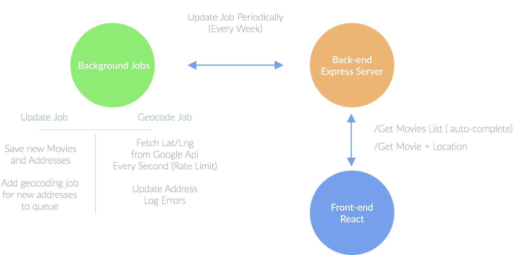

San-Fransisco Movies
====================

[Live Project](https://all-sf-movies.herokuapp.com/)

This web app gives an easy and visual way to showcase the locations of movies scenes filmed in San-Fransisco,
using open data from 'https://data.sfgov.org/resource/wwmu-gmzc.json'.

You can search by movie name, helped by auto-completion. Some basic movie info and a list of locations will be shown. You can select an address to show a pop up on the map.

### Architecture:

The General Architecture is :
 - an Express Back-end
 - a React Front-end
 - MongoDb as persistent database

It was the first time using those three technologies (aside from some reading about React and it's architecture). There was a good deal of documentation reading and testing to get everything together.

It was actually a pretty good occasion to learn and practice more about node and react.

General Structures and Files :

 

The trickiest part of this application was dealing with the movies data :
  - data is rough
  - vague human readable addresses
  - addresses sometimes missing
  - need for geocoding

For scalability and efficiency, I chose to geocode addresses once for each new movie,
avoiding repeated needs to fetch Google Geocode Api for each and every request.

To complement this approach, because of the rate limit on Google Geocode Api,
I made a service ('/tasks/create_seed_data.js') that fetch the movies data, geocode addresses,
and write it all in a .json file, to simplify future seeding of the database.

I chose to handle auto-complete on the client-side. Given the number of movies, it's easier to fetch a list of all the movie titles at first, and sort, filter and search on the client, avoiding extra request/response cycles. In the case where the number of movies come to be big enough, we could push the auto-complete function on the server, and make requests from the client instead.

I used google map api, and google geocode api, for the simplicity and free tier.

Also, Movies and Locations are two separate collections in the mongo database, with a reference to a movie in each location.
There is no main design decision behind, I was practicing. I believe having a simple Movie collection with addresses embedded would actually be more clean and suitable at this stage for this application.

### Trade-offs :

 - Adding Schemas, and Validations to our data on the database, using something like Mongoose I believe, and testing of course.
 
 - Add more tests, testing the edges cases, some integration tests, testing react, and clean up existing tests.

 - For simplicity, geocoding is done on the same process. It's ok in this situation as the data doesn't get updated often, and is separated by 2 seconds intervals (to deal with google rate api)

 - One possible update would be to add a queue system with workers to handle geocoding jobs on a side process (using Kue, RabbitMQ, Beanstalkd, Bull...)
 - We could also add a recurring task for checking and updating movie data every week or so (Scheduler, Agenda).

 - As said earlier, addresses are human wrote (between...and... / from...to...), I only handle addresses with "between". It would be good to handle all different type of addresses, and better the address to lat/lng translation.
 
 - namespacing the Api : as /api/v1/..., is important as the project grows, to help keep a clean and modular API.

General Application with queues and workers:

 

### Todos :

Some possible extra updates, if given more time on the project :

  - add a button on each address in the list to give direction

  - add the possibility to click on the map and get all the nearby movies

  - connect to IMDB or OMDB to get and show movie posters, and general movies info

  - a better responsive design
  
  - Adding routes in the react front-end, for the different movies and locations
  
  
  
### Open locally :

Make sure that you have node and mongo installed.

    git clone https://github.com/JeremyVe/all-sf-movies.git
    
    cd all-sf-movies and npm install
    cd client && npm install

You can copy config/default.js and create development.js and test.js with the appropriate keys (database uri, and google api key)

there is different scripts : 
 - start                 will.. run the express server on :3001 and the react app on :3000
 - create_seed_data      will.. create the data needed to seed
 - seed                  will.. seed the data
 - test                  will.. run the tests
 
in /client, you can also build react :
 - npm run build

You should also change the google_api_key in client/public/index.html script tag, as the keep is limited to the herokuapp host.
